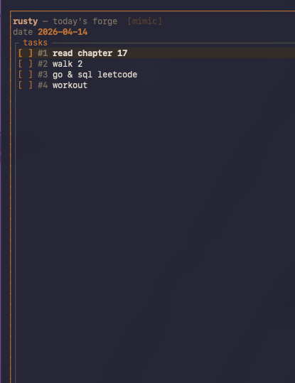

# rusty



A small **daily** terminal to-do app written in Rust. You get a warm-themed [Ratatui](https://github.com/ratatui-org/ratatui) checklist for today’s tasks, plus a JSON file on disk keyed to the **local calendar day**.

Each new day, rusty treats yesterday as closed and moves you to **today**. If the saved `date` in `state.json` is behind today, the app opens a **rollover** screen first: a short recap of yesterday (totals and completion), then every **unfinished** task from that day. You choose what carries forward—**Space** toggles each row, **Y** confirms and builds today’s list from the checked items, **N** or **Esc** starts today with none of them. That way you explicitly decide which “missed” open tasks roll into the new day instead of silently dragging the whole file forward.

## Features

- **Startup**: when the saved `date` is **not** today, that rollover runs once, then the main TUI. **`--ratatui`** runs the same preview only when the file’s date is not today (same calendar day → straight to the TUI, no disk writes). With an empty list, press **a** to add the first task.
- **TUI**: move with **j** / **k** or arrow keys, **Space** / **Enter** toggles done, **q** quits (state is saved).
- **In the UI**: **a** adds a task after the selection, **d** deletes the selected task, **p** moves the selected task to the top.
- **CLI**: `rusty add "…"`, `rusty delete <id>` (alias `rusty rm <id>`).
- **Manual reset**: `rusty --reset`, `rusty -r`, `rusty -reset` (normalized to `--reset`), or `rusty reset` — clears today’s list. You can combine with `add`, e.g. `rusty -reset add "one thing"`.

Run `rusty -h` for built-in help.

## Build and run

Requires a stable Rust toolchain.

```bash
cargo build --release
./target/release/rusty
```

Install on your PATH:

```bash
cargo install --path .
```

## Where state is stored

Tasks live in `state.json` under the app’s **local data** directory from the [`directories`](https://crates.io/crates/directories) crate (`ProjectDirs` for `com.rusty.rusty`). Typical locations:

- **macOS**: `~/Library/Application Support/com.rusty.rusty/state.json`
- **Linux**: `~/.local/share/rusty/state.json` (or `$XDG_DATA_HOME/rusty/state.json`)
- **Windows**: `%LOCALAPPDATA%\rusty\rusty\data\state.json` (pattern from the [`directories`](https://docs.rs/directories) crate)

The file records the session **date** and the task list. On a **new calendar day**, the rollover flow above runs (normal mode then saves today’s date and your carried tasks); on the **same day**, relaunch goes straight to the checklist after normal housekeeping (renumbering, etc.).

## License

No license is set in this repository by default; add one if you publish or share the project.
